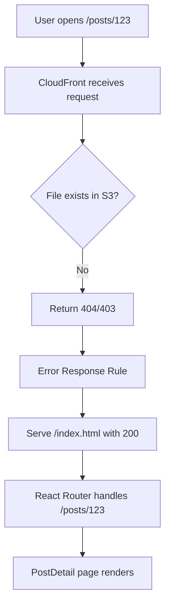
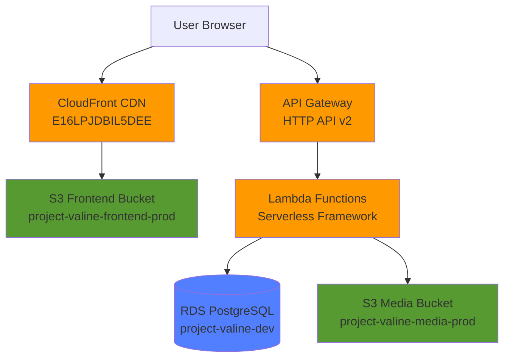
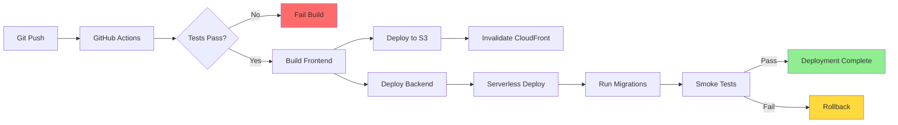

# Gabe's Kanban - Infrastructure, Operations, QA & UX

**Last Updated:** 2026-02-25
**Owner:** Gabriel Colon (Infrastructure/Operations/QA/UX Lead)
**Focus:** Infrastructure, deployment, DevOps, quality assurance, documentation, and UX polish

---

## Quick Reference

### Infrastructure Endpoints
- **Frontend:** https://dkmxy676d3vgc.cloudfront.net
- **CloudFront Distribution:** E16LPJDBIL5DEE
- **API Gateway:** https://i72dxlcfcc.execute-api.us-west-2.amazonaws.com
- **Database:** project-valine-dev.c9aqq6yoiyvt.us-west-2.rds.amazonaws.com
- **S3 Frontend:** s3://project-valine-frontend-prod
- **S3 Media:** s3://project-valine-media-prod (if exists)

### PowerShell Deploy Commands (Full Deployment)
```powershell
# Full production deployment script
cd C:\Users\ghawk\Documents\GitHub\Project-Valine
git checkout main; git pull origin main

# Backend deployment
cd serverless
npm ci
npx serverless deploy --stage prod --region us-west-2

# Frontend build and deploy
cd ..
npm ci
npm run build
aws s3 sync dist/ s3://project-valine-frontend-prod --delete

# CloudFront cache invalidation
aws cloudfront create-invalidation --distribution-id E16LPJDBIL5DEE --paths "/*"

# Database migrations
cd api
npx prisma migrate deploy
npx prisma generate

# Post-deploy verification
cd ..
npm run smoke-test
```

### Quick Deploy (Frontend Only)
```powershell
cd C:\Users\ghawk\Documents\GitHub\Project-Valine
git checkout main; git pull origin main
npm ci
npm run build
aws s3 sync dist/ s3://project-valine-frontend-prod --delete
aws cloudfront create-invalidation --distribution-id E16LPJDBIL5DEE --paths "/*"
```

### AWS CLI Configuration
```bash
# Verify AWS credentials
aws sts get-caller-identity

# List Lambda functions
aws lambda list-functions --region us-west-2 | grep project-valine

# View CloudFront distributions
aws cloudfront list-distributions --query 'DistributionList.Items[*].[Id,DomainName]'

# Check S3 buckets
aws s3 ls | grep project-valine
```

---

## Task Summary

| Category | Total | Completed | In Progress | Not Started |
|----------|-------|-----------|-------------|-------------|
| P0 Infrastructure | 5 | 0 | 0 | 5 |
| P1 DevOps/QA | 4 | 0 | 0 | 4 |
| P2 Security/Infra | 5 | 0 | 0 | 5 |
| UX/Docs | 16 | 11 | 0 | 5 |
| **Total** | **30** | **11** | **0** | **19** |

---

## ✅ Completed Tasks (11)

### ✅ UX-001: Landing page copy update
**Status:** ✅ COMPLETED
**Category:** UX/Content
**Priority:** P1

**What was done:**
- Updated hero section with clear value proposition
- Improved CTA buttons for better conversion
- Updated feature descriptions
- Added social proof elements

**Files changed:**
- src/components/landing/HeroSection.jsx
- src/pages/Landing.jsx

**Verification:**
✅ Confirmed: Landing page has updated copy and CTAs

**Reference:** src/components/landing/, Marketing feedback

---

### ✅ UX-002: USER_FLOWS.md documentation
**Status:** ✅ COMPLETED
**Category:** Documentation
**Priority:** P0

**What was done:**
- Documented all 17 user flows end-to-end
- Added mermaid diagrams for complex flows
- Included API endpoints and error states
- Cross-referenced with Kanban tasks

**Files created:**
- docs/USER_FLOWS.md (complete)
- docs/USER_FLOWS_SUMMARY.md

**Verification:**
✅ Confirmed: USER_FLOWS.md exists with comprehensive flow documentation

**Reference:** docs/USER_FLOWS.md

---

### ✅ UX-003: About page order fix
**Status:** ✅ COMPLETED
**Category:** UX
**Priority:** P2

**What was done:**
- Fixed ordering of team members on About page
- Improved layout and responsive design
- Updated team member bios

**Files changed:**
- src/pages/About.jsx

**Verification:**
✅ Confirmed: About page has correct team member ordering

**Reference:** src/pages/About.jsx

---

### ✅ UX-007: Empty state CTAs improvement
**Status:** ✅ COMPLETED (PR #423)
**Category:** UX/Content
**Priority:** P1

**What was done:**
- Improved empty state messaging across all pages
- Better CTA button labels and placement
- Enhanced user guidance for next actions
- Applied to Dashboard, Inbox, Profile tabs

**Files changed:**
- src/components/EmptyState.jsx - Improved messaging
- Multiple page components - Better CTA integration

**Verification:**
✅ Confirmed: Empty states show clear next actions

**Reference:** PR #423

---

### ✅ UX-008: Form validation feedback improvements
**Status:** ✅ COMPLETED (PR #423)
**Category:** UX/Forms
**Priority:** P1

**What was done:**
- Enhanced form validation with clear error messages
- Real-time validation feedback
- Improved error state styling
- Better accessibility for screen readers

**Files changed:**
- src/pages/ProfileEdit.jsx - Enhanced validation
- src/pages/Settings.jsx - Improved error states

**Verification:**
✅ Confirmed: Form errors clear and actionable

**Reference:** PR #423

---

### ✅ UX-009: FAQ styling cleanup
**Status:** ✅ COMPLETED (PR #423)
**Category:** UX/Content
**Priority:** P2

**What was done:**
- Removed visual bugs (green line on FAQ items)
- Improved spacing and typography
- Better mobile responsiveness
- Cleaner accordion animation

**Files changed:**
- src/pages/Marketing.jsx - FAQ section styling

**Verification:**
✅ Confirmed: FAQ displays cleanly without visual artifacts

**Reference:** PR #423

---

### ✅ UX-010: Marketing copy polish
**Status:** ✅ COMPLETED (PR #420)
**Category:** UX/Content
**Priority:** P1

**What was done:**
- Removed em-dashes from marketing copy
- Simplified language for clarity
- Updated CTA button labels
- Improved FAQ formatting

**Files changed:**
- src/pages/Marketing.jsx - Copy updates

**Verification:**
✅ Confirmed: Marketing copy clear and professional

**Reference:** PR #420

---

### ✅ UX-011: Contact Us page
**Status:** ✅ COMPLETED (PR #421)
**Category:** Infrastructure/Frontend
**Priority:** P1

**What was done:**
- Created /contact route and page
- Wired contact form (or email link)
- Email canonicalized to joint-networking.com
- Added to main navigation/footer

**Files changed:**
- src/pages/ContactUs.jsx (created)
- src/App.jsx - Route added
- Navigation components - Link added

**Verification:**
✅ Confirmed: /contact loads; form/email link works

**Reference:** PR #421

---

### ✅ UX-012: Email canonicalization to joint-networking.com
**Status:** ✅ COMPLETED (PR #421)
**Category:** Infrastructure/Docs
**Priority:** P2

**What was done:**
- All support/contact emails now use joint-networking.com
- Updated across documentation
- Consistent branding
- No more mixed email domains

**Files changed:**
- Multiple documentation files
- Frontend contact displays

**Verification:**
✅ Confirmed: All email references use joint-networking.com

**Reference:** PR #421

---

### ✅ UX-013: Profile layout improvements (LinkedIn-style)
**Status:** ✅ COMPLETED (PR #414)
**Category:** UX/Profile
**Priority:** P1

**What was done:**
- Profile redesigned with horizontal layout
- Avatar, bio, stats side-by-side
- Better visual hierarchy
- Onboarding banner upload added

**Files changed:**
- src/pages/Profile.jsx - Layout redesign
- src/pages/Onboarding/* - Banner upload

**Verification:**
✅ Confirmed: Profile displays horizontally; banner upload works

**Reference:** PR #414

---

### ✅ UX-014: Onboarding text and banner improvements
**Status:** ✅ COMPLETED (PR #414)
**Category:** UX/Onboarding
**Priority:** P1

**What was done:**
- Updated onboarding copy for clarity
- Added banner upload step
- Improved progress indicators
- Better step transitions

**Files changed:**
- src/pages/Onboarding/* - Multiple improvements

**Verification:**
✅ Confirmed: Onboarding flow smooth; banner upload works

**Reference:** PR #414

## 📋 P0 Critical Infrastructure Tasks (5 remaining)

### INFRA-001: CloudFront SPA deep-link fix
**Status:** Not Started
**Priority:** P0 | **Estimate:** S (2-4h)
**User Flow:** Flow 6 (View Post Detail)

**What:** Fix CloudFront to handle SPA deep links (direct URLs like /posts/123)

**Problem:**
- Direct URLs return 404 because CloudFront doesn't know to serve index.html
- Hard refresh on any route except / fails
- Shared links to posts don't work

**Solution:**
Configure CloudFront error responses to redirect 403/404 to index.html

**Steps:**
1. [ ] Open CloudFront console → Distribution E16LPJDBIL5DEE
2. [ ] Go to Error Pages tab
3. [ ] Create custom error response:
   - HTTP Error Code: 403 Forbidden
   - Response Page Path: /index.html
   - HTTP Response Code: 200 OK
4. [ ] Create second custom error response:
   - HTTP Error Code: 404 Not Found
   - Response Page Path: /index.html
   - HTTP Response Code: 200 OK
5. [ ] Wait for CloudFront to deploy changes (~5 minutes)
6. [ ] Test:
   - Direct URL to /posts/[some-id]
   - Direct URL to /profile/[username]
   - Hard refresh on any route
   - 404 on actual missing routes still shows 404 page

**Mermaid Diagram:**


**Testing:**
```bash
# Test direct URLs
curl -I https://dkmxy676d3vgc.cloudfront.net/posts/test123
# Should return 200, not 404

# Test actual 404s still work
curl -I https://dkmxy676d3vgc.cloudfront.net/some-missing-asset.js
# Should return 404
```

**Reference:** docs/KANBAN_PROGRESS.md P0-001, AWS CloudFront docs

---

### INFRA-002: Smoke test suite
**Status:** Not Started
**Priority:** P0 | **Estimate:** M (4-6h)
**User Flow:** All flows

**What:** Automated smoke tests to run after each deployment

**Required checks:**
1. ✅ Frontend loads (200 response)
2. ✅ API health endpoint responds
3. ✅ Database connection works
4. ✅ S3 media bucket accessible
5. ✅ CloudFront serving frontend correctly
6. ✅ Auth endpoints respond (login, signup)
7. ✅ Critical pages load (dashboard, profile, posts)

**Implementation:**
```javascript
// scripts/smoke-test.js
const tests = [
  { name: 'Frontend loads', url: 'https://dkmxy676d3vgc.cloudfront.net' },
  { name: 'API health', url: 'https://i72dxlcfcc.execute-api.us-west-2.amazonaws.com/health' },
  { name: 'Auth endpoint', url: 'https://i72dxlcfcc.execute-api.us-west-2.amazonaws.com/auth/health' },
  // ... more tests
];

async function runSmokeTests() {
  for (const test of tests) {
    try {
      const response = await fetch(test.url);
      if (response.ok) {
        console.log(`✅ ${test.name}`);
      } else {
        console.error(`❌ ${test.name} - Status: ${response.status}`);
        process.exit(1);
      }
    } catch (error) {
      console.error(`❌ ${test.name} - Error: ${error.message}`);
      process.exit(1);
    }
  }
}
```

**Files to create:**
- scripts/smoke-test.js
- Add to package.json: `"smoke-test": "node scripts/smoke-test.js"`

**Integration:**
- Add to GitHub Actions post-deploy
- Run locally after PowerShell deploy script

**Reference:** docs/OPERATIONS.md, CI/CD best practices

---

### INFRA-003: Deploy rollback procedure
**Status:** Not Started
**Priority:** P0 | **Estimate:** M (4-6h)

**What:** Document and automate rollback process for failed deployments

**Rollback scenarios:**
1. **Frontend rollback:** Revert S3 to previous build
2. **Backend rollback:** Redeploy previous Serverless version
3. **Database rollback:** Revert Prisma migration (if safe)

**PowerShell Rollback Script:**
```powershell
# scripts/rollback.ps1
param(
    [Parameter(Mandatory=$true)]
    [ValidateSet('frontend','backend','database','all')]
    [string]$Component,
    
    [Parameter(Mandatory=$false)]
    [string]$Version
)

function Rollback-Frontend {
    Write-Host "Rolling back frontend to previous S3 version..."
    aws s3api list-object-versions --bucket project-valine-frontend-prod --prefix index.html
    # Restore previous version
    # Invalidate CloudFront cache
}

function Rollback-Backend {
    Write-Host "Rolling back backend Lambda functions..."
    cd serverless
    # List recent deployments
    npx serverless deploy list --stage prod
    # Deploy specific version
    # npx serverless deploy --stage prod --package .serverless-previous
}

function Rollback-Database {
    Write-Host "⚠️  Database rollback requires manual intervention!"
    Write-Host "Check docs/TROUBLESHOOTING.md for migration rollback steps"
}

# Execute rollback based on component
switch ($Component) {
    'frontend' { Rollback-Frontend }
    'backend' { Rollback-Backend }
    'database' { Rollback-Database }
    'all' {
        Rollback-Frontend
        Rollback-Backend
        Write-Host "Database rollback requires manual steps - see docs"
    }
}
```

**Documentation needed:**
- [ ] docs/TROUBLESHOOTING.md - Rollback procedures section
- [ ] docs/DEPLOYMENT_BIBLE.md - Update with rollback commands
- [ ] Keep last 3 deployment artifacts in S3/Serverless

**Testing:**
1. Deploy to staging
2. Test rollback script
3. Verify system returns to previous state

**Reference:** docs/DEPLOYMENT_BIBLE.md, AWS deployment best practices

---

### INFRA-004: Database connection pool monitoring
**Status:** Not Started
**Priority:** P0 | **Estimate:** M (4-6h)

**What:** Monitor Prisma connection pool in Lambda cold starts

**Problem:**
- Lambda cold starts may exhaust database connections
- Recent fix needs production validation
- No visibility into connection pool usage

**Solution:**

1. **Add CloudWatch metrics:**
```javascript
// serverless/src/utils/prisma.js
const { PrismaClient } = require('@prisma/client');

let prisma;

function getPrismaClient() {
  if (!prisma) {
    prisma = new PrismaClient({
      log: ['query', 'error', 'warn'],
      datasources: {
        db: {
          url: process.env.DATABASE_URL
        }
      }
    });
    
    // Track connection pool metrics
    prisma.$on('query', (e) => {
      console.log('Query duration:', e.duration, 'ms');
      // Send to CloudWatch
    });
  }
  return prisma;
}

module.exports = { getPrismaClient };
```

2. **Create CloudWatch dashboard:**
   - Database connection count
   - Query duration (p50, p95, p99)
   - Cold start frequency
   - Lambda concurrent executions

3. **Set up alarms:**
   - Alert if connection count > 80% of max
   - Alert if query duration > 5 seconds
   - Alert if Lambda errors spike

**Testing:**
- Load test with 50 concurrent users
- Monitor connection pool during test
- Verify connections are released properly

**Reference:** docs/REPO_AUDIT_TRUTH_DOC.md P0 risks, Prisma connection pooling docs

---

### INFRA-005: Load testing before beta-50
**Status:** Not Started
**Priority:** P0 | **Estimate:** M (8-12h)
**Dependencies:** Staging environment (P1-002)

**What:** Run load tests to ensure system handles 50 concurrent users

**Load test scenarios:**
1. **Authentication spike:** 50 users login simultaneously
2. **Feed load:** 50 users scroll dashboard feed
3. **Post creation:** 10 users create posts concurrently
4. **Media upload:** 10 users upload images simultaneously
5. **API burst:** 100 req/sec to various endpoints

**Tools:**
- Artillery.io (load testing framework)
- AWS CloudWatch (monitor metrics)
- k6 (alternative: more detailed metrics)

**Artillery test script:**
```yaml
# tests/load/basic-load-test.yml
config:
  target: 'https://i72dxlcfcc.execute-api.us-west-2.amazonaws.com'
  phases:
    - duration: 60
      arrivalRate: 10
      name: Warm up
    - duration: 120
      arrivalRate: 50
      name: Sustained load
    - duration: 60
      arrivalRate: 100
      name: Spike test
  processor: "./auth-processor.js"

scenarios:
  - name: "User login and browse feed"
    flow:
      - post:
          url: "/auth/login"
          json:
            email: "test{{ $randomNumber() }}@example.com"
            password: "Test123!@#"
          capture:
            - json: "$.token"
              as: "authToken"
      - get:
          url: "/feed"
          headers:
            Authorization: "Bearer {{ authToken }}"
      - get:
          url: "/posts"
          headers:
            Authorization: "Bearer {{ authToken }}"
```

**Success criteria:**
- ✅ p95 response time < 500ms
- ✅ p99 response time < 2 seconds
- ✅ Zero 500 errors
- ✅ < 1% 4xx errors
- ✅ Database connections stable
- ✅ Lambda cold starts < 5%

**What to monitor during test:**
- CloudWatch Lambda metrics
- RDS database CPU/connections
- API Gateway throttling
- S3 request rates

**Reference:** docs/OPERATIONS.md, Artillery.io docs

---

## 📋 P1 High Priority DevOps/QA Tasks (4 remaining)

### P1-001: Staging environment setup
**Status:** Not Started
**Priority:** P1 | **Estimate:** L (16-24h)

**What:** Create full staging environment (staging.joint.com) for pre-production testing

**Infrastructure needed:**
1. **Frontend:** S3 bucket + CloudFront distribution (staging)
2. **Backend:** Serverless stage=staging (separate Lambda functions)
3. **Database:** RDS staging instance OR use dev database with staging schema
4. **DNS:** staging.dkmxy676d3vgc.cloudfront.net or staging.joint.com

**Environment variables:**
```bash
# Staging environment
STAGE=staging
DATABASE_URL=postgresql://...project-valine-staging.../postgres
VITE_API_BASE_URL=https://api-staging.execute-api.us-west-2.amazonaws.com
VITE_ENABLE_AUTH=true
VITE_ENABLE_DEV_BYPASS=false
EMAIL_ENABLED=true  # Use real emails in staging
```

**Deployment pipeline:**
- Merge to `develop` branch → auto-deploy to staging
- Smoke tests pass → manual promotion to prod
- Staging is always latest develop code

**Cost estimate:**
- RDS staging: $20-30/month (db.t3.micro)
- Lambda staging: ~$5/month (low usage)
- CloudFront staging: ~$5/month
- Total: ~$30-40/month

**Reference:** AWS multi-environment best practices

---

### P1-002: Playwright E2E test suite
**Status:** Not Started
**Priority:** P1 | **Estimate:** L (24h+)
**Dependencies:** Staging environment

**What:** Automated E2E tests for critical user flows using Playwright

**Test coverage:**
1. ✅ Flow 1: Signup → Onboarding → Dashboard
2. ✅ Flow 2: Edit profile → Save → View profile
3. ✅ Flow 3: Create post → View in feed
4. ✅ Flow 5: Login → Dashboard
5. ✅ Flow 6: View post detail
6. ✅ Flow 7: Upload avatar image
7. ✅ Flow 8: Like post, add comment

**Playwright test example:**
```javascript
// tests/e2e/signup-flow.spec.js
import { test, expect } from '@playwright/test';

test('User can signup and complete onboarding', async ({ page }) => {
  await page.goto('https://staging.joint.com/signup');
  
  // Fill signup form
  await page.fill('input[name="email"]', 'test@example.com');
  await page.fill('input[name="password"]', 'Test123!@#');
  await page.fill('input[name="username"]', 'testuser');
  await page.click('button[type="submit"]');
  
  // Should redirect to onboarding
  await expect(page).toHaveURL(/.*onboarding/);
  
  // Complete onboarding steps
  await page.fill('input[name="displayName"]', 'Test User');
  await page.selectOption('select[name="role"]', 'artist');
  await page.click('button:has-text("Next")');
  
  // ... more steps
  
  // Should end up on dashboard
  await expect(page).toHaveURL(/.*dashboard/);
  await expect(page.locator('h1')).toContainText('Dashboard');
});
```

**Files to create:**
- tests/e2e/ directory
- playwright.config.js (already exists, verify config)
- GitHub Actions workflow for E2E tests

**Run schedule:**
- On every PR to main
- Nightly on staging
- Before production deploy

**Reference:** playwright.dev, existing playwright.config.js

---

### P1-003: Database backup automation
**Status:** Not Started
**Priority:** P1 | **Estimate:** M (4-6h)

**What:** Automated daily database backups with retention policy

**AWS RDS automatic backups:**
1. [ ] Enable automated backups in RDS console
2. [ ] Set backup retention: 7 days
3. [ ] Set backup window: 3am-4am UTC (low traffic)
4. [ ] Enable point-in-time recovery

**Additional S3 backups:**
```bash
# scripts/backup-database.sh
#!/bin/bash

DATE=$(date +%Y-%m-%d)
BACKUP_FILE="project-valine-backup-$DATE.sql"
S3_BUCKET="s3://project-valine-backups"

# Dump database
pg_dump $DATABASE_URL > $BACKUP_FILE

# Compress
gzip $BACKUP_FILE

# Upload to S3
aws s3 cp $BACKUP_FILE.gz $S3_BUCKET/

# Verify backup
aws s3 ls $S3_BUCKET/$BACKUP_FILE.gz

# Delete local file
rm $BACKUP_FILE.gz

echo "Backup completed: $BACKUP_FILE.gz"
```

**Automation:**
- AWS Lambda function triggered by CloudWatch Events (daily at 3am)
- Or GitHub Actions scheduled workflow

**Backup retention:**
- Daily backups: Keep 7 days
- Weekly backups: Keep 4 weeks
- Monthly backups: Keep 12 months

**Test restore:**
```bash
# Restore from backup to staging
aws s3 cp s3://project-valine-backups/backup-2026-02-18.sql.gz .
gunzip backup-2026-02-18.sql.gz
psql $STAGING_DATABASE_URL < backup-2026-02-18.sql
```

**Reference:** AWS RDS backup docs, disaster recovery best practices

---

### P1-004: Error tracking (Sentry)
**Status:** Not Started
**Priority:** P1 | **Estimate:** M (4-6h)

**What:** Set up Sentry for error tracking in frontend and backend

**Setup steps:**

1. **Create Sentry account:**
   - Sign up at sentry.io
   - Create project: "Project Valine Frontend"
   - Create project: "Project Valine Backend"

2. **Frontend integration:**
```javascript
// src/main.jsx
import * as Sentry from "@sentry/react";

Sentry.init({
  dsn: import.meta.env.VITE_SENTRY_DSN,
  environment: import.meta.env.MODE,
  integrations: [
    new Sentry.BrowserTracing(),
    new Sentry.Replay()
  ],
  tracesSampleRate: 0.1,
  replaysSessionSampleRate: 0.1,
  replaysOnErrorSampleRate: 1.0,
  beforeSend(event, hint) {
    // Don't send errors in development
    if (import.meta.env.DEV) return null;
    return event;
  }
});
```

3. **Backend integration:**
```javascript
// serverless/src/handler.js
const Sentry = require("@sentry/serverless");

Sentry.AWSLambda.init({
  dsn: process.env.SENTRY_DSN,
  environment: process.env.STAGE,
  tracesSampleRate: 0.1,
});

exports.handler = Sentry.AWSLambda.wrapHandler(async (event, context) => {
  // Your handler code
});
```

4. **Configure alerts:**
   - Slack integration for critical errors
   - Email for unresolved errors after 24h
   - Weekly digest of error trends

**What to track:**
- Unhandled exceptions
- API errors (non-200 responses)
- Failed database queries
- Authentication failures
- Frontend crashes

**Reference:** sentry.io/docs, error monitoring best practices

---

## 📋 P2 Security & Infrastructure Tasks (5 remaining)

### P2-001: WAF (Web Application Firewall)
**Status:** Not Started
**Priority:** P2 | **Estimate:** M (8-12h)

**What:** Enable AWS WAF on CloudFront and API Gateway for DDoS protection

**WAF rules to implement:**
1. **Rate limiting:** Max 100 requests/5min per IP
2. **Geographic blocking:** Block high-risk countries (if needed)
3. **SQL injection protection:** Block common SQL injection patterns
4. **XSS protection:** Block script injection attempts
5. **Known bad inputs:** AWS Managed Rules for OWASP Top 10

**Cost:** ~$5-15/month depending on traffic

**Configuration:**
```json
{
  "Rules": [
    {
      "Name": "RateLimitRule",
      "Priority": 1,
      "Statement": {
        "RateBasedStatement": {
          "Limit": 100,
          "AggregateKeyType": "IP"
        }
      },
      "Action": { "Block": {} }
    },
    {
      "Name": "AWSManagedRulesCommonRuleSet",
      "Priority": 2,
      "Statement": {
        "ManagedRuleGroupStatement": {
          "VendorName": "AWS",
          "Name": "AWSManagedRulesCommonRuleSet"
        }
      },
      "OverrideAction": { "None": {} }
    }
  ]
}
```

**Reference:** AWS WAF documentation, OWASP Top 10

---

### P2-002: Content Security Policy (CSP)
**Status:** Not Started
**Priority:** P2 | **Estimate:** M (4-6h)

**What:** Implement strict CSP headers to prevent XSS attacks

**CSP header configuration:**
```javascript
// CloudFront function or Lambda@Edge
const cspHeader = [
  "default-src 'self'",
  "script-src 'self' 'unsafe-inline' https://www.googletagmanager.com",
  "style-src 'self' 'unsafe-inline' https://fonts.googleapis.com",
  "font-src 'self' https://fonts.gstatic.com",
  "img-src 'self' https: data:",
  "media-src 'self' https://project-valine-media-prod.s3.amazonaws.com",
  "connect-src 'self' https://i72dxlcfcc.execute-api.us-west-2.amazonaws.com",
  "frame-ancestors 'none'",
  "base-uri 'self'",
  "form-action 'self'"
].join('; ');

// Add to CloudFront response headers
response.headers['content-security-policy'] = { value: cspHeader };
```

**Other security headers:**
```javascript
{
  'Strict-Transport-Security': 'max-age=31536000; includeSubDomains',
  'X-Content-Type-Options': 'nosniff',
  'X-Frame-Options': 'DENY',
  'X-XSS-Protection': '1; mode=block',
  'Referrer-Policy': 'strict-origin-when-cross-origin'
}
```

**Testing:**
- Use securityheaders.com to verify headers
- Check browser console for CSP violations
- Ensure all third-party scripts are allowed

**Reference:** MDN CSP docs, OWASP security headers

---

### P2-003: API rate limiting
**Status:** Not Started
**Priority:** P2 | **Estimate:** M (4-6h)

**What:** Implement granular rate limiting per API endpoint

**Rate limit tiers:**
```javascript
const rateLimits = {
  // Authentication endpoints
  '/auth/login': { limit: 5, window: '5m' },
  '/auth/register': { limit: 3, window: '1h' },
  '/auth/request-password-reset': { limit: 3, window: '1h' },
  
  // Content creation
  '/posts': { limit: 20, window: '1h' },
  '/comments': { limit: 50, window: '1h' },
  '/messages': { limit: 100, window: '1h' },
  
  // Read operations
  '/feed': { limit: 100, window: '5m' },
  '/posts/:id': { limit: 200, window: '5m' },
  '/profiles/:username': { limit: 100, window: '5m' },
  
  // Media uploads
  '/media/upload': { limit: 10, window: '1h' }
};
```

**Implementation options:**
1. **API Gateway usage plans:** Native rate limiting
2. **Redis + middleware:** More flexible, requires Redis instance
3. **WAF rate limiting:** IP-based (already covered in P2-001)

**Recommended:** API Gateway usage plans for simplicity

**Error response:**
```json
{
  "error": "Rate limit exceeded",
  "message": "Too many requests. Please try again in 5 minutes.",
  "retryAfter": 300
}
```

**Reference:** API Gateway rate limiting docs, Redis rate limiting patterns

---

### P2-004: Documentation drift audit
**Status:** Not Started
**Priority:** P2 | **Estimate:** M (8-12h)

**What:** Reconcile inconsistencies across documentation files

**Known issues:**
1. **Onboarding steps:** Some docs say 6 steps, some say 5
2. **API endpoints:** Some docs have outdated endpoint names
3. **Environment variables:** Scattered across multiple docs
4. **User flows:** Some flows missing from main docs

**Audit checklist:**
- [ ] docs/REPO_AUDIT_TRUTH_DOC.md (source of truth)
- [ ] docs/USER_FLOWS.md
- [ ] docs/API_REFERENCE.md
- [ ] docs/DEPLOYMENT_BIBLE.md
- [ ] docs/CONTRACTOR_ONBOARDING.md
- [ ] docs/TROUBLESHOOTING.md
- [ ] docs/OPERATIONS.md
- [ ] README.md
- [ ] CONTRIBUTING.md

**Create single source of truth:**
- [ ] docs/GLOSSARY.md - Define all terms once
- [ ] docs/ENV_VARIABLES.md - All environment variables documented
- [ ] docs/API_ENDPOINTS.md - Complete API reference

**Tools:**
- Use markdown linter (.markdownlintrc already exists)
- Create docs/INDEX.md with links to all docs
- Add "Last Updated" dates to all docs

**Reference:** docs/REPO_AUDIT_TRUTH_DOC.md §8.5

---

### P2-005: Cost monitoring and alerts
**Status:** Not Started
**Priority:** P2 | **Estimate:** S (2-4h)

**What:** Set up AWS cost monitoring and budget alerts

**AWS Budget setup:**
1. **Monthly budget:** $100/month (beta-50 target)
2. **Alerts:**
   - 50% of budget ($50) → Email to Gabe
   - 80% of budget ($80) → Email to all stakeholders
   - 100% of budget ($100) → Urgent alert + investigate
   - Forecasted to exceed → Weekly alert

**Cost breakdown tracking:**
- Lambda invocations
- RDS database hours
- S3 storage and requests
- CloudFront data transfer
- API Gateway requests

**Cost optimization checklist:**
- [ ] Use Lambda reserved concurrency for predictable workloads
- [ ] Enable S3 lifecycle policies (move old media to Glacier)
- [ ] Use CloudFront caching effectively (reduce origin requests)
- [ ] Right-size RDS instance (start with db.t3.micro)
- [ ] Delete unused Lambda versions (keep last 3)

**Cost dashboard:**
- AWS Cost Explorer dashboard
- CloudWatch dashboard with cost metrics
- Weekly cost report to stakeholders

**Reference:** AWS Cost Management docs, FinOps best practices

---

## 📋 UX & Documentation Tasks (5 remaining)

### UX-004: Responsive design audit
**Status:** Not Started
**Priority:** P1 | **Estimate:** M (8-12h)

**What:** Ensure all pages work on mobile, tablet, and desktop

**Test devices:**
- Mobile: iPhone SE (375px), iPhone 12 Pro (390px), Pixel 5 (393px)
- Tablet: iPad (768px), iPad Pro (1024px)
- Desktop: 1280px, 1440px, 1920px

**Pages to audit:**
1. ✅ Landing page
2. ⏳ Dashboard/Feed
3. ⏳ Post detail
4. ⏳ Profile page
5. ⏳ Edit profile
6. ⏳ Onboarding flow
7. ⏳ Settings
8. ⏳ Messages

**Common issues to fix:**
- Text too small on mobile
- Buttons too close together (touch targets < 44px)
- Horizontal scrolling
- Images not responsive
- Modals don't fit on small screens
- Navigation menu overlaps content

**Tools:**
- Chrome DevTools device emulator
- BrowserStack for real device testing
- Lighthouse mobile audit

**Acceptance criteria:**
- ✅ All pages readable on 375px width
- ✅ Touch targets minimum 44x44px
- ✅ No horizontal scrolling
- ✅ Images scale appropriately
- ✅ Text legible without zooming

**Reference:** Responsive design best practices, Material Design guidelines

---

### UX-005: Accessibility audit (WCAG 2.1 AA)
**Status:** Not Started
**Priority:** P2 | **Estimate:** L (16-24h)

**What:** Ensure platform meets WCAG 2.1 Level AA standards

**Key areas:**
1. **Keyboard navigation:** All interactive elements accessible via keyboard
2. **Screen reader support:** Proper ARIA labels and semantic HTML
3. **Color contrast:** Text meets 4.5:1 contrast ratio
4. **Focus indicators:** Visible focus states on all interactive elements
5. **Alt text:** All images have descriptive alt text
6. **Form labels:** All inputs have associated labels
7. **Heading structure:** Proper h1-h6 hierarchy

**Testing tools:**
- axe DevTools browser extension
- WAVE accessibility checker
- Lighthouse accessibility audit
- NVDA or JAWS screen reader testing

**Common fixes:**
```jsx
// Before: No ARIA label
<button onClick={handleClick}>
  <HeartIcon />
</button>

// After: With ARIA label
<button onClick={handleClick} aria-label="Like post">
  <HeartIcon aria-hidden="true" />
</button>

// Before: Low contrast
<span className="text-gray-400">Subtle text</span>

// After: Sufficient contrast
<span className="text-gray-600">Readable text</span>
```

**Acceptance criteria:**
- ✅ Zero critical issues in axe DevTools
- ✅ All images have alt text
- ✅ All forms keyboard-accessible
- ✅ Color contrast ≥ 4.5:1 for normal text
- ✅ Page structure navigable by screen reader

**Reference:** WCAG 2.1 guidelines, a11y project checklist

---

### UX-006: Loading states and skeleton screens
**Status:** Not Started
**Priority:** P2 | **Estimate:** M (8-12h)

**What:** Add loading states to improve perceived performance

**Pages needing skeleton screens:**
1. Dashboard feed (loading posts)
2. Profile page (loading user data)
3. Post detail (loading comments)
4. Messages (loading conversations)

**Implementation:**
```jsx
// Example: Post skeleton
function PostSkeleton() {
  return (
    <div className="animate-pulse">
      <div className="flex items-center space-x-4">
        <div className="rounded-full bg-gray-300 h-12 w-12"></div>
        <div className="flex-1 space-y-2">
          <div className="h-4 bg-gray-300 rounded w-3/4"></div>
          <div className="h-4 bg-gray-300 rounded w-1/2"></div>
        </div>
      </div>
      <div className="mt-4 space-y-2">
        <div className="h-4 bg-gray-300 rounded"></div>
        <div className="h-4 bg-gray-300 rounded"></div>
        <div className="h-64 bg-gray-300 rounded mt-2"></div>
      </div>
    </div>
  );
}
```

**Loading indicators:**
- Spinner for quick actions (< 2 seconds)
- Skeleton screens for page loads
- Progress bars for uploads
- Optimistic UI for mutations

**Reference:** UI loading state patterns, Tailwind skeleton screens

---

### DOC-001: Create deployment runbook
**Status:** Not Started
**Priority:** P1 | **Estimate:** M (4-6h)

**What:** Comprehensive deployment runbook for emergency situations

**Contents:**

1. **Pre-deployment checklist:**
   - [ ] All tests pass
   - [ ] Code review approved
   - [ ] Staging smoke tests pass
   - [ ] Database migrations reviewed
   - [ ] Rollback plan documented

2. **Deployment steps:**
   - Step-by-step PowerShell commands
   - Expected output at each step
   - How to verify success
   - When to proceed vs. rollback

3. **Post-deployment verification:**
   - Smoke test URLs
   - CloudWatch metrics to check
   - User-facing features to test manually

4. **Rollback procedures:**
   - Frontend rollback (S3 versioning)
   - Backend rollback (Serverless previous version)
   - Database rollback (Prisma migration revert)
   - When to rollback vs. hotfix

5. **Emergency contacts:**
   - Gabe (infrastructure)
   - Brendan (backend/frontend)
   - Justin (product decisions)
   - AWS support (if needed)

6. **Common issues and fixes:**
   - "CloudFront still serving old version" → Invalidate cache
   - "Lambda cold starts causing timeouts" → Pre-warm functions
   - "Database connection errors" → Check connection pool

**File to create:**
- docs/DEPLOYMENT_RUNBOOK.md

**Reference:** docs/DEPLOYMENT_BIBLE.md, docs/TROUBLESHOOTING.md

---

### DOC-002: Incident response plan
**Status:** Not Started
**Priority:** P2 | **Estimate:** M (4-6h)

**What:** Document incident response procedures for production outages

**Incident severity levels:**

**P0 - Critical:** Platform down, no users can access
- Response time: Immediate (< 5 minutes)
- Escalation: All hands on deck
- Communication: Status page + Twitter/email to all users

**P1 - High:** Core features broken (auth, posting, feed)
- Response time: < 30 minutes
- Escalation: Primary on-call + backup
- Communication: Status page update

**P2 - Medium:** Non-core features broken (search, messages)
- Response time: < 2 hours
- Escalation: Primary on-call
- Communication: Internal tracking, fix in next deploy

**P3 - Low:** Minor bugs, UX issues
- Response time: Next business day
- Escalation: Normal bug triage
- Communication: GitHub issue

**Incident response checklist:**
1. [ ] Detect issue (monitoring alerts, user reports)
2. [ ] Assess severity and impact
3. [ ] Create incident channel (Slack, Discord)
4. [ ] Assign incident commander
5. [ ] Investigate and diagnose root cause
6. [ ] Implement fix or rollback
7. [ ] Verify resolution
8. [ ] Post-mortem (within 48 hours)
9. [ ] Document learnings

**Post-mortem template:**
```markdown
# Incident Post-Mortem: [Title]

**Date:** 2026-02-18
**Duration:** 2 hours 15 minutes
**Severity:** P1 - High
**Impact:** 30% of users unable to login

## Timeline
- 10:15 AM: First user report of login failures
- 10:20 AM: Incident detected via CloudWatch alarm
- 10:25 AM: Investigation begins
- 11:30 AM: Root cause identified (database connection pool exhausted)
- 11:45 AM: Fix deployed (increased pool size)
- 12:30 PM: Incident resolved, monitoring stable

## Root Cause
[Detailed explanation]

## Resolution
[What we did to fix it]

## Action Items
- [ ] Increase default connection pool size
- [ ] Add connection pool monitoring
- [ ] Load test authentication flow

## Learnings
[What we learned and how to prevent next time]
```

**File to create:**
- docs/INCIDENT_RESPONSE.md

**Reference:** SRE incident response best practices, PagerDuty runbooks

---

## Infrastructure Diagrams

### Current Architecture



### Deployment Flow



---

## Key Metrics to Monitor

### Infrastructure Health
- **Lambda:** Invocations, errors, duration, cold starts
- **API Gateway:** Request count, 4xx/5xx errors, latency
- **RDS:** CPU utilization, connections, query duration
- **CloudFront:** Cache hit rate, error rate, data transfer
- **S3:** Request count, 4xx errors, storage used

### Application Performance
- **Response time:** p50, p95, p99 per endpoint
- **Error rate:** % of requests returning errors
- **Availability:** Uptime (target: 99.9%)
- **Database queries:** Slow queries (> 1 second)

### User Experience
- **Page load time:** First contentful paint < 1.8s
- **Time to interactive:** < 3.8s
- **Cumulative layout shift:** < 0.1
- **Largest contentful paint:** < 2.5s

---

## Support & Questions

**Documentation:**
- docs/DEPLOYMENT_BIBLE.md - Deployment procedures
- docs/OPERATIONS.md - Day-to-day operations
- docs/TROUBLESHOOTING.md - Common issues and fixes
- docs/ARCHITECTURE.md - System architecture overview

**Stakeholders:**
- **Infrastructure:** Gabriel Colon
- **Engineering:** Brendan
- **Product:** Justin Valine

**Emergency Contacts:**
- Gabe (Infrastructure): [contact info]
- AWS Support: [support plan details]

---

**End of Gabe's Kanban**
