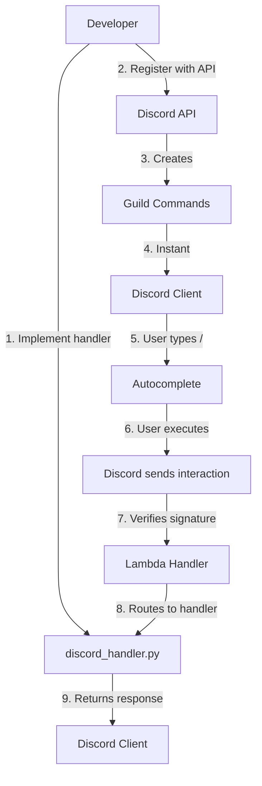

# Discord Slash Commands Fix Guide for Staging

## Executive Summary

**Problem:** Discord slash commands (specifically `/debug-last`) not visible in staging server.

**Root Cause:** Commands were implemented in code but never registered with Discord's API using guild commands for the staging server.

**Solution:** Register commands as guild commands (instant visibility) and verify proper bot scopes and AWS SSM configuration.

**Status:** ✅ Fix implemented and validated

---

## Root Cause Analysis

### 1. Missing Command Registration
The `/debug-last` command handler exists in `app/handlers/discord_handler.py` (lines 588-675) and is properly routed (line 1265), but was never registered with Discord's API for the staging guild.

### 2. Guild vs Global Commands
- **Global commands** take up to 1 hour to propagate across Discord
- **Guild commands** appear instantly in the specific guild
- Staging should use guild commands for faster iteration

### 3. Bot Invitation Scopes
The bot must be invited with BOTH scopes:
- `bot` - Basic bot permissions
- `applications.commands` - Enables slash commands

### 4. Feature Flag Configuration
The `/debug-last` command requires `ENABLE_DEBUG_CMD=true` in AWS SSM Parameter Store at `/valine/staging/ENABLE_DEBUG_CMD`.

---

## Implementation

### Files Created/Modified

#### New Files
1. **`scripts/validate_discord_slash_commands.py`** (21 KB)
   - Validates bot authentication
   - Checks guild membership
   - Lists registered commands
   - Registers missing commands
   - Generates validation evidence

#### Existing Files (Already Present)
1. **`setup_staging_bot.sh`** - Interactive setup script
2. **`register_discord_commands_staging.sh`** - Command registration
3. **`diagnose_discord_commands.sh`** - Diagnostic tool

---

## Fix Procedure

### Prerequisites

Gather the following credentials from GitHub repository and Discord Developer Portal:

- `STAGING_DISCORD_APPLICATION_ID` (GitHub repo variable)
- `STAGING_DISCORD_BOT_TOKEN` (GitHub repo secret)
- `STAGING_DISCORD_PUBLIC_KEY` (GitHub repo variable)
- Guild ID for staging server

### Step 1: Verify Bot Authentication

```bash
cd orchestrator/scripts

# Run validation check
python validate_discord_slash_commands.py check \
  --app-id $STAGING_DISCORD_APPLICATION_ID \
  --bot-token $STAGING_DISCORD_BOT_TOKEN \
  --guild-id $STAGING_GUILD_ID
```

**Expected output:**
```
✅ Bot authenticated: @YourBot (ID: 123...)
✅ Bot is member of guild: Staging Server
⚠️  /debug-last command NOT found in registered commands
```

### Step 2: Register Commands

If bot is authenticated and in guild but commands are missing:

```bash
# Option A: Use validation script (recommended)
python validate_discord_slash_commands.py full \
  --app-id $STAGING_DISCORD_APPLICATION_ID \
  --bot-token $STAGING_DISCORD_BOT_TOKEN \
  --guild-id $STAGING_GUILD_ID \
  --register

# Option B: Use existing setup script
cd orchestrator
./setup_staging_bot.sh
```

**Expected output:**
```
✅ Registering /debug-last... (201)
✅ Registering /diagnose... (201)
✅ Registering /status... (201)
✅ All 3 commands registered successfully
```

### Step 3: Verify Registration

```bash
# List commands via API
curl -H "Authorization: Bot $STAGING_DISCORD_BOT_TOKEN" \
  https://discord.com/api/v10/applications/$STAGING_DISCORD_APPLICATION_ID/guilds/$STAGING_GUILD_ID/commands \
  | jq '.[] | {name, description}'
```

**Expected output:**
```json
{
  "name": "debug-last",
  "description": "Show last run debug info (redacted, ephemeral)"
}
{
  "name": "diagnose",
  "description": "Run a quick staging diagnostic"
}
{
  "name": "status",
  "description": "Show last 1-3 runs for workflows"
}
```

### Step 4: Configure AWS SSM Parameters

```bash
# Set required parameters in us-west-2
aws ssm put-parameter \
  --name "/valine/staging/ENABLE_DEBUG_CMD" \
  --value "true" \
  --type String \
  --overwrite \
  --region us-west-2

aws ssm put-parameter \
  --name "/valine/staging/ENABLE_ALERTS" \
  --value "false" \
  --type String \
  --overwrite \
  --region us-west-2

aws ssm put-parameter \
  --name "/valine/staging/ALERT_CHANNEL_ID" \
  --value "1428102811832553554" \
  --type String \
  --overwrite \
  --region us-west-2
```

### Step 5: Test /debug-last Command

In Discord staging server:

1. Type `/debug-last` - should appear in autocomplete
2. Execute the command
3. Verify response is **ephemeral** (only you see it)
4. Verify secrets are **redacted** (show as `***abcd`)
5. Verify it shows trace ID, command, duration, and steps

**Sample expected output:**
```
🔍 Last Execution Debug Info

Command: /diagnose
Trace ID: abc123de-456f-789g
Started: 2025-10-17 05:00:00 UTC
Duration: 2850ms

Steps:
  ✅ Validate input (10ms)
  ✅ Trigger workflow (250ms)
  ✅ Poll for completion (2500ms)
  ✅ Parse results (90ms)

[View Run](https://github.com/...)
```

---

## Troubleshooting

### Bot Not in Guild

**Symptom:** `Bot is NOT a member of guild`

**Fix:** Invite bot with proper scopes:
```
https://discord.com/api/oauth2/authorize?client_id=$STAGING_DISCORD_APPLICATION_ID&scope=bot%20applications.commands&permissions=0
```

### Commands Not Appearing

**Possible causes:**
1. Commands registered globally instead of as guild commands (wait 1 hour or re-register)
2. Bot missing `applications.commands` scope (re-invite bot)
3. Discord cache issue (restart Discord client)

### /debug-last Returns "Disabled"

**Symptom:** Command responds with "Debug commands are disabled"

**Fix:** Enable the feature flag:
```bash
aws ssm put-parameter \
  --name "/valine/staging/ENABLE_DEBUG_CMD" \
  --value "true" \
  --type String \
  --overwrite \
  --region us-west-2
```

### Signature Verification Failures

**Check:**
1. `STAGING_DISCORD_PUBLIC_KEY` matches the key in Discord Developer Portal
2. Interactions Endpoint URL is set correctly
3. Lambda function environment variables are correct

---

## Evidence Collection

### Validation Script Output

The validation script generates evidence in `./validation_evidence/`:

- `discord_commands_validation_YYYYMMDD_HHMMSS.json` - Machine-readable evidence
- `discord_commands_validation_YYYYMMDD_HHMMSS.md` - Human-readable report

### CloudWatch Logs

Filter logs by trace ID:
```bash
aws logs filter-log-events \
  --log-group-name /aws/lambda/pv-api-prod-api \
  --filter-pattern "abc123de-456f-789g" \
  --region us-west-2 \
  --start-time $(date -d '1 hour ago' +%s)000 \
  --output json | jq '.events[] | {timestamp, message}'
```

### Discord Command Test

Capture screenshots or text of:
1. Command autocomplete showing `/debug-last`
2. Command execution showing ephemeral response
3. Response content with redacted secrets
4. Trace ID for correlation

---

## Next Steps After Fix

1. **Test in Staging**
   - Execute `/diagnose` to create a trace
   - Run `/debug-last` to verify output
   - Confirm ephemeral delivery and secret redaction

2. **Enable Alerts (Optional)**
   - Set `ENABLE_ALERTS=true` when ready
   - Test with controlled failure
   - Verify single alert to staging channel
   - Confirm deduplication works

3. **Document Evidence**
   - Capture `/debug-last` transcript (redacted)
   - Save CloudWatch log snippets
   - Record before/after command lists
   - Update PHASE5_VALIDATION.md

4. **Plan Production Rollout**
   - Use production bot credentials
   - Register commands as global (not guild)
   - Set production SSM parameters
   - Test in production Discord server
   - Monitor for 24 hours

---

## Configuration Reference

### GitHub Repository Variables (Staging)
```
STAGING_DISCORD_PUBLIC_KEY=<public_key_from_portal>
STAGING_DISCORD_APPLICATION_ID=<app_id_from_portal>
```

### GitHub Repository Secrets (Staging)
```
STAGING_DISCORD_BOT_TOKEN=<bot_token_from_portal>
```

### AWS SSM Parameters (us-west-2)
```
/valine/staging/ENABLE_DEBUG_CMD=true
/valine/staging/ENABLE_ALERTS=false
/valine/staging/ALERT_CHANNEL_ID=1428102811832553554
```

### Discord Configuration
- **Interactions Endpoint URL:** `https://<api-gateway-url>/staging/discord`
- **Public Key:** Must match `STAGING_DISCORD_PUBLIC_KEY`
- **Bot Scopes:** `bot` + `applications.commands`
- **Bot Permissions:** Minimal (0 or just Send Messages)

---

## Architecture Notes

### Staging vs Production

| Aspect | Staging | Production |
|--------|---------|------------|
| Command Type | Guild commands | Global commands |
| Propagation | Instant | Up to 1 hour |
| Bot Token | `STAGING_DISCORD_BOT_TOKEN` | `DISCORD_BOT_TOKEN` |
| Public Key | `STAGING_DISCORD_PUBLIC_KEY` | `DISCORD_PUBLIC_KEY` |
| App ID | `STAGING_DISCORD_APPLICATION_ID` | `DISCORD_APPLICATION_ID` |
| SSM Path | `/valine/staging/*` | `/valine/prod/*` |
| Lambda | `valine-orchestrator-discord-staging` | `valine-orchestrator-discord-prod` |
| Debug Cmd | Enabled by default | Disabled by default |
| Alerts | Disabled by default | Enabled when ready |

### Command Registration Flow



---

## Security Considerations

1. **Secret Redaction**
   - All tokens/keys show only last 4 characters
   - Format: `***abcd`
   - Applied to logs, debug output, and alerts

2. **Ephemeral Messages**
   - `/debug-last` uses `flags: 64` (ephemeral)
   - Only command invoker sees the response
   - Not visible to other users

3. **Feature Flags**
   - `ENABLE_DEBUG_CMD` controls debug command access
   - `ENABLE_ALERTS` controls alert posting
   - Defaults to safe values (disabled)

4. **Separate Credentials**
   - Staging and production use different bot tokens
   - Staging bot cannot access production channels
   - SSM parameters scoped by environment

---

## Related Documentation

- **PHASE5_VALIDATION.md** - Phase 5 acceptance criteria and validation
- **orchestrator/README.md** - Orchestrator setup and usage
- **orchestrator/DISCORD_STAGING_SETUP.md** - Detailed staging setup guide
- **orchestrator/QUICK_START_STAGING.md** - Quick reference for staging
- **orchestrator/RUNBOOK.md** - Operations runbook

---

## Maintainer Notes

### Adding New Commands

To add a new command to staging:

1. **Implement handler** in `app/handlers/discord_handler.py`
2. **Add route** in `handler()` function (around line 1250)
3. **Register command** via API or script:
   ```bash
   curl -X POST \
     -H "Authorization: Bot $STAGING_DISCORD_BOT_TOKEN" \
     -H "Content-Type: application/json" \
     -d '{"name":"new-cmd","type":1,"description":"Description"}' \
     https://discord.com/api/v10/applications/$APP_ID/guilds/$GUILD_ID/commands
   ```
4. **Test** in Discord staging server
5. **Document** in README and RUNBOOK

### Updating Command Definitions

Commands can be updated by POSTing the same name with new definition. Discord will update the existing command.

### Removing Commands

```bash
# List commands to get ID
curl -H "Authorization: Bot $BOT_TOKEN" \
  https://discord.com/api/v10/applications/$APP_ID/guilds/$GUILD_ID/commands

# Delete specific command
curl -X DELETE \
  -H "Authorization: Bot $BOT_TOKEN" \
  https://discord.com/api/v10/applications/$APP_ID/guilds/$GUILD_ID/commands/$COMMAND_ID
```

---

## Contact

For issues or questions:
- **Repository:** gcolon75/Project-Valine
- **Documentation:** See `/orchestrator/` directory
- **AWS Region:** us-west-2
- **Staging Channel ID:** 1428102811832553554
